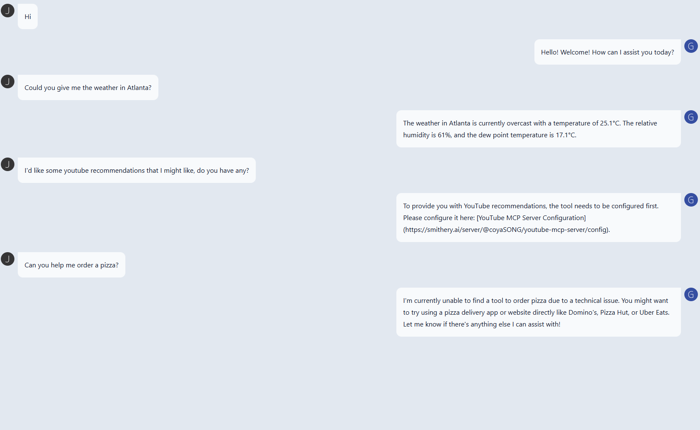
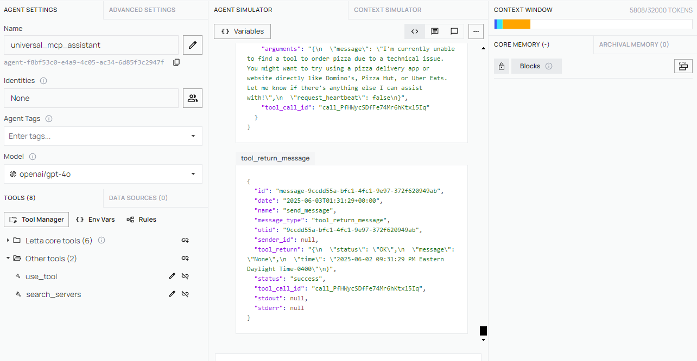

# Universal MCP Assistant

A modular FastAPI application that provides a universal interface for interacting with MCP (Model Context Protocol) servers through Letta agents.

## Project Structure

```
universal-mcp-assistant/
├── src/
│   ├── api/
│   │   ├── __init__.py
│   │   └── chat.py              # Chat API routes
│   ├── core/
│   │   ├── __init__.py
│   │   ├── letta_client.py      # Letta client management
│   │   └── chat_service.py      # Chat business logic
│   ├── models/
│   │   ├── __init__.py
│   │   └── chat.py              # Pydantic models
│   └── __init__.py
├── config/
│   └── mcp_config.json          # MCP server configuration
├── public/
│   └── chat.html                # Chat UI frontend
├── main.py                      # Application entry point
└── README.md                    # This file
```

## Features

- **MCP Integration**: Seamless integration with MCP servers through Letta agents
 1. **Single “Toolbox” MCP Server (Smithery)**  
     - Under the hood, all high-level requests go through one central “Toolbox” MCP server.  
     - The toolbox examines the user’s query, figures out which specialized MCP server (weather, YouTube, GitHub, etc.) should handle it, and forwards along relevant arguments.  
     - This means you only need to configure one “Toolbox” entry in `config/mcp_config.json`; it will dynamically route each request to the correct MCP.
 2. **Automatic Tool Routing**  
     - Weather queries (e.g. “What’s the weather in Atlanta?”) and similar tools which don't need configuration are detected and automatically dispatched to the weather MCP tool.  
     - If the user asks about YouTube recommendations (or any tool that requires an API key), the assistant will respond with a prompt to configure that particular MCP (e.g., “Please configure the YouTube MCP server with your API key”).  
     - If no MCP tool is available for a given request, the assistant replies with a graceful fallback message (for example: “I’m currently unable to find a tool to order pizza. You might want to use a delivery app directly.”).
- **FastAPI Backend**: High-performance async API with automatic documentation
- **Modern UI**: Tailwind CSS-powered chat interface
- **Agent Observability**: Full visibility into every Letta‐agent tool call, return value, and core‐memory update.


## Architecture

Under the hood, `universal_mcp_assistant` uses Letta, which itself is built on MemGPT. MemGPT treats an LLM as an “operating system” that can manage its own context windows, memory blocks, and tool invocations. In other words:

1. **MemGPT as LLM-OS**  
   - When your Letta agent receives a user question, MemGPT helps it automatically chunk and manage long conversations so that no context is ever lost.  
   - MemGPT’s “LLM-as-OS” paradigm means Letta can dynamically append to, read from, or evict parts of its core memory—allowing the agent to stay within token limits while still “remembering” earlier exchanges.

2. **Letta on Top of MemGPT**  
   - Letta gets access to additional tools (e.g., `use_tool`, `search_servers`) via and MCP server which adds higher‐level orchestration on top of MemGPT’s memory primitives.  
   - When Letta needs to call an MCP server, it asks MemGPT to package up the arguments (user message + memory) into a well-formed JSON payload.  
   - MemGPT then ensures that this payload fits within the model’s context window. After the tool returns, MemGPT appends the result back into memory so Letta can use it in the final response.

3. **Putting It All Together**  
   - Your FastAPI endpoints simply forward user messages to Letta.  
   - Letta leverages MemGPT’s memory management features to preserve long-running conversational state.  
   - The Smithery Toolbox (and any other MCP servers) are invoked via Letta’s “tool” API, which MemGPT orchestrates under the hood.

---

## Screenshots



> **Demonstration of automatic tool routing**  
> 1. **Weather Query**: The assistant sees “Could you give me the weather in Atlanta?” and automatically calls the weather MCP.  
> 2. **YouTube Recommendations**: When the user asks for YouTube recommendations, the assistant replies:  
>    > “To provide you with YouTube recommendations, the tool needs to be configured first. Please configure it here: [YouTube MCP Server Configuration](https://smithery.ai/server/@coyaSONG/youtube-mcp-server/config).”  
> 3. **Fallback Example**: If the user says “Can you help me order a pizza?” (and no public pizza-ordering MCP is available yet), the assistant responds with a polite fallback:  
>    > “I’m currently unable to find a tool to order pizza due to a technical issue. You might want to try using a pizza delivery app directly like Domino’s, Pizza Hut, or Uber Eats.”  

---


## Agent Observability

When you spin up `universal_mcp_assistant` through Letta, you can watch each step of the agent’s reasoning (tool calls, arguments, returns, and memory) in real time. The screenshot below shows:

- The Letta “Agent Simulator” pane where a `use_tool` call is made  
- The JSON response payload coming back from the tool (e.g., `tool_return_message`)  
- How core memory and tool outputs live side-by-side  



> In this view you can see the raw arguments sent to `use_tool`, the JSON that comes back (`"status":"OK", "message":…`), and how the agent stitches that response into its next reply.

## Quick Start

### Prerequisites

- Python 3.8+
- Letta server running on `localhost:8283`
- MCP servers configured (e.g., Smithery Toolbox)

### Installation

1. Clone the repository:
```bash
git clone https://github.com/ahv15/universal-mcp-assistant.git
cd universal-mcp-assistant
```

2. Install dependencies:
```bash
pip install fastapi uvicorn letta-client pydantic
```

3. Configure MCP servers in `config/mcp_config.json`:
```json
{
  "mcpServers": {
    "toolbox": {
      "command": "cmd",
      "args": [
        "/c",
        "npx",
        "-y",
        "@smithery/cli@latest",
        "run",
        "@smithery/toolbox",
        "--key",
        "YOUR_SMITHERY_KEY_HERE",
        "--profile",
        "YOUR_PROFILE_HERE"
      ]
    }
  }
}
```

### Running the Application

1. Start the FastAPI server:
```bash
python main.py
```

2. Open the chat interface:
   - Open `public/chat.html` in your browser
   - Or visit the API docs at `http://localhost:8000/docs`

## API Endpoints

### POST /chat

Send a message to the MCP assistant.

**Request:**
```json
{
  "message": "Your message here"
}
```

**Response:**
```json
{
  "reply": "Assistant's response"
}
```

## Configuration

### MCP Servers

Configure your MCP servers in `config/mcp_config.json`. The application currently supports:

- **Smithery Toolbox**: Acts as a single “tool gateway” that your app queries. It inspects each request, dynamically forwards it to the correct hosted MCP server (e.g., weather, YouTube, GitHub), and then returns the tool’s response back to your assistant.
- **Custom MCP Servers**: Add your own server configurations

### Letta Agent

The Letta agent is configured with:
- Model: `openai/gpt-4o`
- Embedding: `openai/text-embedding-3-small`
- Tool routing through MCP servers


## Troubleshooting

### Common Issues

1. **Letta Connection Error**: Ensure Letta server is running on `localhost:8283`
2. **MCP Server Not Found**: Check your MCP server configuration and ensure tools are available
3. **CORS Issues**: Verify the `allow_origins` setting in the CORS middleware

### Debugging

- Check the FastAPI logs for detailed error messages
- Use the interactive API docs at `/docs` to test endpoints
- Verify MCP server status through Letta client
